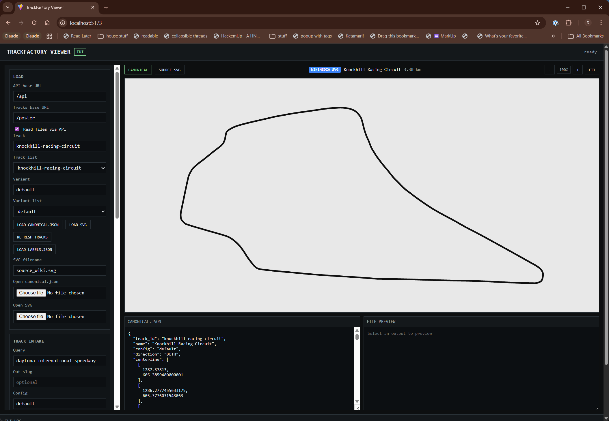

# TrackFactory

Automated pipeline for extracting, normalizing, and rendering racetrack centerlines from multiple sources.



## What it does

TrackFactory ingests racetrack geometry from several source types and produces a normalized `canonical.json` for each track/config combination:

| Source | How it works |
|--------|-------------|
| **Wikimedia SVG** | Searches Wikimedia Commons for circuit diagrams, extracts the longest `<path>`, converts to a centerline |
| **OpenStreetMap** | Queries Overpass for `highway=raceway` ways, merges and projects to UTM |
| **Raster poster** | Extracts ~94 track outlines from the "Racetracks of the World to Scale" poster via contour detection and Chaikin smoothing |

Each track goes through QA (closure, self-intersection, length sanity) and gets rendered to SVG.

## Quick start

```bash
pip install -e .

# Ingest a track (search + ingest + QA + render)
tf build "Spa-Francorchamps"

# Ingest all Wikimedia SVG variants
tf build-variants "Nurburgring"

# Extract tracks from the poster image
tf poster-ingest racetracks-poster.jpg --skip-ocr

# Run QA on a track
tf qa spa-francorchamps

# Render SVGs
tf render spa-francorchamps
```

## CLI commands

| Command | Description |
|---------|-------------|
| `tf search <query>` | Search for track sources without ingesting |
| `tf build <query>` | Search, ingest, QA, and render a single track |
| `tf build-variants <query>` | Build all Wikimedia SVG variants for a track |
| `tf ingest <source> <slug>` | Ingest a specific source URL |
| `tf qa <track-id>` | Run QA checks on an existing track |
| `tf render <track-id>` | Render centerline + debug SVGs |
| `tf batch <file>` | Batch-process tracks from a text file |
| `tf poster-ingest <image>` | Extract tracks from a raster poster image |

## Web viewer

A React + TypeScript viewer for inspecting and editing track outputs.

```bash
cd web
npm install
npm run dev
```

Opens at `http://localhost:5173`. Features:

- Auto-loads `canonical.json` when switching tracks/configs
- Source type badges (OSM, SVG, poster) with metadata display
- Scroll-wheel zoom (cursor-centered) and drag-to-pan
- Inline canonical.json editor with live preview
- Label placement tool for annotating tracks
- SVG export with custom stroke/fill styling
- Track intake UI for running CLI builds from the browser

The API server (port 5174) proxies CLI commands and serves track files. It expects `tf` on your PATH. Configure with `TRACKS_ROOT` and `PORT` env vars.

## Project structure

```
trackfactory/
  cli.py              # Typer CLI entry point (tf)
  geom/               # Polyline ops, Chaikin smoothing, QA, shape matching
  ingest/             # Source ingesters: SVG, OSM, poster raster
  resolver/           # Source discovery + Pydantic data models
  store/              # Canonical JSON + SVG file I/O
  render/             # SVG rendering from centerlines
web/
  src/App.tsx          # React viewer SPA
  server/server.mjs    # Express API proxy for the CLI
tracks/                # Output directory (gitignored)
  {track-id}/{config}/
    canonical.json     # Normalized track data
    centerline.svg     # Clean centerline render
    debug.svg          # Debug render with QA overlay
    source_wiki.svg    # Original Wikimedia SVG (if applicable)
    sources.json       # Source provenance
```

## Data model

Each track is stored as a `TrackCanonical` (Pydantic):

```json
{
  "track_id": "spa-francorchamps",
  "name": "Spa-Francorchamps",
  "config": "default",
  "centerline": [[x, y], ...],
  "length_m": 7004.0,
  "qa": { "is_simple": true, "is_closed": true },
  "provenance": [{ "source_type": "wikimedia_svg", "url": "..." }]
}
```

Centerlines are `[[x, y], ...]` in meters (UTM for OSM, pixel-scaled for SVG/poster). Source types: `wikimedia_svg`, `osm`, `poster`, `pdf`, `other`.

## LLM-assisted variants (optional)

Set an env var to enable LLM-based variant ranking and naming:

```bash
export TRACKFACTORY_LLM_CMD_CLAUDE="claude -p --model opus"
```

The LLM ranks Wikimedia SVG candidates and assigns config slugs (e.g. `road-course-2024`, `nordschleife-1967`).

## Requirements

- Python 3.13+
- Node.js 18+ (for the web viewer)

### Python dependencies

`typer`, `rich`, `httpx`, `pydantic`, `svgpathtools`, `lxml`, `opencv-python-headless`, `numpy`, `shapely`, `pyproj`

Optional: `easyocr` for poster legend OCR (`pip install -e .[ocr]`)

## Tests

```bash
pip install -e .[dev]
pytest
```

## Notes

- Wikimedia Commons requires a proper User-Agent to avoid 403s; TrackFactory sets a policy-compliant one.
- OSM ingestion uses Overpass API and projects coordinates to UTM for planar geometry.
- The poster ingest module uses Chaikin corner-cutting to smooth pixel-level contour jaggedness.
